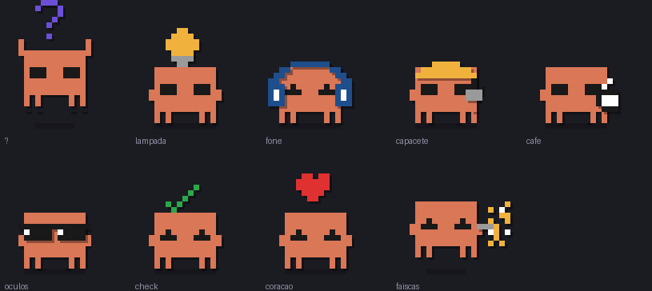

<h1 align="center">claude-reminder</h1>

<p align="center">
  <b>O mascote do Claude aparece, se mexe e faz barulho quando o Claude precisa de você.</b><br>
  Clique nele e você volta direto pro terminal.
</p>

<p align="center">
  
</p>

<p align="center">
  <sub>X11 · Claude Code · zero dependência nova</sub>
</p>

---

## O problema

Você manda o Claude Code trabalhar, troca de janela e vai fazer outra coisa. O
Claude para no meio pedindo permissão pra rodar um comando — e fica esperando.
Em silêncio. Você só descobre dez minutos depois.

O sino do terminal não diz **o que** aconteceu nem **em qual monitor**. A
notificação do GNOME some sozinha. Numa área de trabalho de vários monitores,
o terminal é fácil demais de perder de vista.

## A solução

Um bichinho de 70 pixels entra andando no canto inferior direito do monitor
que está em foco, toca um som e fica pulando até você responder. Clicou nele,
o terminal volta pra frente e ele sai andando.

---

## Instalação

Dentro do Claude Code:

```
/plugin marketplace add rafaelmaestro/claude-reminder
/plugin install claude-mascot@claude-reminder
```

Reinicie a sessão. Pronto — não tem passo dois.

### Requisitos

Tudo isso já vem no Ubuntu com GNOME. Se estiver faltando algo:

```bash
sudo apt install python3-gi gir1.2-webkit2-4.1 xdotool pipewire-bin \
                 sound-theme-freedesktop
```

| precisa de | por quê |
| --- | --- |
| **X11** | posicionar janela, always-on-top e recorte de clique |
| `python3-gi` (GTK 3.0 + WebKit2 4.1) | desenhar e animar o mascote |
| `xdotool` | achar o monitor em foco e devolver o foco ao terminal |
| `pw-play` (PipeWire) | tocar o som |
| `sound-theme-freedesktop` | os arquivos de som |

> **Wayland não funciona.** No Wayland um aplicativo comum não pode se
> posicionar sozinho na tela. Se você não tem `DISPLAY` — sessão por SSH,
> headless — o plugin simplesmente não faz nada, sem erro nenhum.

---

## O que dispara o quê

| hook do Claude Code | o que acontece |
| --- | --- |
| `Notification` | pedido de permissão → mascote entra e insiste |
| `PreToolUse` · `AskUserQuestion` | Claude fez uma pergunta → mesma coisa |
| `PostToolUse` | você aprovou e a ferramenta rodou → mascote sai |
| `Stop` | Claude terminou → comemoração e tchauzinho |
| `SessionStart` | grava qual janela é o seu terminal (pro clique funcionar) |

Nenhum hook lê, altera ou atrasa decisão de ferramenta. Todos saem
imediatamente com código 0 e deixam a animação rodando em outro processo.

---

## Configuração

Opcional. Copie `claude-mascot/config.example.json` para
`~/.config/claude-mascot/config.json`:

| chave | padrão | o que faz |
| --- | --- | --- |
| `enabled` | `true` | desliga tudo sem desinstalar |
| `states.ask` | `true` | mascote no pedido de permissão |
| `states.done` | `true` | mascote no fim da tarefa |
| `mute` | `false` | mantém a animação, corta o som |
| `volume` | `1.0` | 0 a 1 |
| `ask_timeout` | `60` | segundos até ele desistir sozinho |
| `cell` | `7` | pixels por célula — **o tamanho do boneco** |
| `sounds.ask` / `sounds.done` | sons do sistema | caminho de outro arquivo |

Arquivo ausente ou com JSON inválido: usa os padrões e segue funcionando.

**Achou pequeno?** `"cell": 10`. **Achou intrusivo?** `"cell": 5` e
`"mute": true`.

---

## Limitações conhecidas

- X11 apenas. Wayland, macOS e Windows não.
- Um mascote por vez na máquina — várias sessões do Claude Code disputam o
  mesmo canto, e o evento mais recente vence.
- O clique depende da janela do terminal registrada no `SessionStart`. Se ela
  não existir mais, o clique só dispensa o mascote em vez de trocar de janela.

## Créditos

Mascote inspirado no bichinho pixel art do Claude Code. Os frames são
redesenhados na grade, não extraídos de arte de terceiros.
